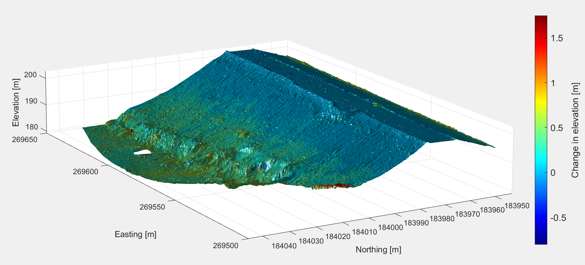

# 3D-tiff-plot
Plot a GeoTIFF in 3D with the option of coloring the 3D plot by attribute (e.g., a DEM of Difference TIFF).

## Overview
This is a MATLAB script that, as presented, is configured to take as input two GeoTIFFs of a given area: (1) a digital elevation model (DEM) GeoTIFF and (2) a GeoTIFF to be used as an attribute for color--in this case, a DEM of Difference (DoD). The script also takes as input the bounds of the desired plot in the reference coordinate system of the DEM GeoTIFF.

## How it works
*Note: This script requires the Mapping Toolbox.*

Both TIFFs are read using `readgeoraster()`, which provides each pixel's digital number as well as the TIFF's world reference information. From the world reference of both, the inner bounds of where the two TIFFs overlap are determined by finding, in both the X- and Y-dimensions, the maximum of the minimum bounds and the minimum of the maximum bounds.

To ensure both TIFFs align to each other, both will be interpolated to a new grid that is created within the inner bounds. This new grid aligns to the level of precision of the attribute TIFF (i.e., the TIFF to be used for coloring the plot). For example, if the attribute TIFF's cells are 0.1 m by 0.1 m, the new grid's coordinates will align to the nearest 0.1 m of the world coordinate system. The coordinates of a given point in the new grid might be, say, E, N \[m\]: 12358.0, 314159.3.

The user input of plot bounds is converted from world XY to column and row. For a given point in world coordinates $(X,Y)$:

$\text{col}=\dfrac{(X - X_\text{min})}{\text{pix}_X}+1$

$\text{row}=\dfrac{(Y_\text{max} - Y)}{\text{pix}_Y}+1$

where $X_\text{min}$ and $Y_\text{max}$ are elements of the bounds of the interpolated grid in world coordinates and $\text{pix}$ are the dimensions of the pixel in $X$ and $Y$ as denoted by the subscript. (The $+1$ is necessary for MATLAB as array elements are numbered starting from 1.)

The remainder of the script plots the surface and sets a number of attributes of the plot. The surface and the axis object handles are passed into the workspace for ease of manipulation.

## How to use
The script needs only three items of user input:

1. `elev_tiff`: The DEM TIFF filename to be used for the elevation of the surface plot
2. `color_tiff`: The atttribute TIFF filename used to color the surface plot
3. `plot_easting` and `plot_northing`: `1x2` arrays of the desired surface plot's bounds

## Caveats
This script does not check the `MapCellsReference` objects of the two TIFFs to ensure they are compatiable (e.g., that they share the same projected CRS). 

Plotting a 3D surface from a TIFF that covers a very large area can be resource intensive, so be mindful of the user-defined plot bounds. If plotting a large area, it is recommended to manipulate the view angle of the 3D plot using `view()` and not clicking and dragging in the figure.
